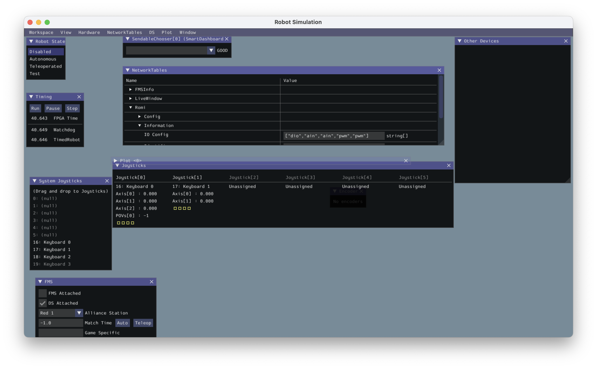

[comment]: render
# Day 06 CS570
## Starting to program the ROMI

### Starting to code a Robot

Now that we have access to the ```wpilib``` libraries we can start to write code to make our robot move. Let's discuss 
a little bit about how that works. You will probably want to start the First-ROMI PyCharm Project that we started as that 
project hopefully has access to the libraries we need.

#### Writing the most basic Robot

##### Import a basic Robot class to subclass

Start by creating a file in your project called ```robot.py```. FRC robots all start with file called robot.py, and this is
a default to help competitions work. In ```robot.py``` we will build a subclass of a robot class that is defined in wpilib
called ```TimedRobot```. To do this will need to put the following line at the top of the file:

```python
from wpilib import TimedRobot
```

This allows use to reference ```TimedRobot``` by simply typing ```TimedRobot```. There are times when you might have libraries
that have classes of the same name, and then there could be confusion about which one you meant. In that case, you would want
to do the following import:

```python
import wpilib
```

And then when you want to use ```TimedRobot``` you would type ```wpilib.TimedRobot```, this indicates that you want the 
```TimedRobot``` class from the ```wpilib``` library.

##### Start to write out the subclass

Add in the following lines:

```python
from wpilib import TimedRobot

class MyRobot(TimedRobot):
    
   def robotInit(self):
       '''This method is called as the robot turns on and is often used to setup the 
       joysticks and other presets.'''
        pass
    
    def robotPeriodic(self):
        '''This is called every cycle of the code. In general the code is loop
         through every .02 seconds.'''
        pass
    
    def autonomousInit(self):
        '''This is called once when the robot enters autonomous mode.'''
        pass

    def autonomousPeriodic(self):
        '''This is called every cycle while the robot is in autonomous.'''
        pass
    
    def teleopInit(self):
        '''This is called once at the start of Teleop.'''
        pass

    def teleopPeriodic(self):
        '''This is called once every cycle during Teleop'''
        pass

    ### There are other methods that you can overwrite for when the robot is 
    # disabled, or when the robot is in Test mode.
```

This file and these methods are the main nerve center of the robot code. Good robot code doesn't have much in these methods, 
because we want to farm out the functionality to lots of different files so that they can worked on by several people independently.


### A less than perfect robot

Let's continue to work only in this file for now, and then we will refactor our work to a different file and clean up our code.

Our goal is get the robot to drive. Here is the checklist of things that we need to address to get the ROMI to drive. 

* Set up a **Controller** of some type. Take readings from the controller.
* Create a way to activate the motors
* Connect the information from the controllers to 

#### Setting up the controller


We will need an object to represent a joystick, the ```wpilib``` library already supplies one called ```Joystick```. Let's 
import that class and make Joystick object and say the Joystick connects on port 0. A port is simply a place that you might plug
something in to your computer. 

At the top of the file alter the import to read:

```python
from wpilib import TimedRobot, Joystick
```

And a little further down in the code alter ```robotInit```, delete the word pass and add in the line about a controller.

```python
    def robotInit(self):
        '''This method is called as the robot turns on and is often used to 
        setup the joysticks and other presets.'''
        self.controller=Joystick(0)

```

Now we have a controller. To see what methods our controller can do you can see them [here](https://robotpy.readthedocs.io/projects/wpilib/en/latest/wpilib/Joystick.html#wpilib.Joystick)
Because ```Joystick``` is a subclass of ```GenericHID``` (Human Interface Device) you can also access the methods [here](https://robotpy.readthedocs.io/projects/wpilib/en/latest/wpilib.interfaces/GenericHID.html#wpilib.interfaces.GenericHID)

#### Setting up the motors

Now let's give this robot some motors. The motors we have aren't Spark motors, but they can be run by the same software, 
so let's create a left and right motor and indicate which input that they are attached to. According to the ROMI documentation
the left motor is port 0, and the right is port 1 (the documentation is found [here](https://docs.wpilib.org/en/stable/docs/romi-robot/getting-to-know-romi.html)).

We are also going to use even more from the ```wpilib``` library. The library has a class that does all the work for a Differential Drive system.
A Differential Drive system is where you have wheels on both sides that are independently set to speeds. This allows you to
move forward and rotate. We won't need to code that we will just need to utilize the methods in the ```wpilib``` class.


Again we will edit the imports and the ```robotInit``` method.

```python
from wpilib import TimedRobot, Joystick, Spark
from wpilib.drive import DifferentialDrive
```


```python
    def robotInit(self):
        '''This method is called as the robot turns on and is often used to setup the joysticks and other presets.'''
        self.controller=Joystick(0)
        self.left_motor=Spark(0)
        self.right_motor=Spark(1)
        self.drivetrain = DifferentialDrive(self.left_motor, self.right_motor)
```

#### Connect the joystick to the motors

This will happen in the teleop periodic for us. We will use methods that come with all the objects that we have brought
in from ```wpilib```. 

```python
    def teleopPeriodic(self):
        '''This is called once every cycle during Teleop'''
        forward=self.controller.getRawAxis(0)
        rotate=self.controller.getRawAxis(1)
        self.drivetrain.arcadeDrive(forward,rotate)
```

#### Make it runnable

We have one last thing to do before we test out our robot. Because ```robot.py``` is the file that the FRC software runs 
we have to make it runnable. This means that we need a declaration at the bottom that says if this is the main file to 
do something. Put this out at the bottom of your file and make sure it is not indented at all. 

```python
if __name__ == "__main__":
    # If your ROMI isn't at the default address, set that here
    os.environ["HALSIMWS_HOST"] = "10.0.0.2"
    os.environ["HALSIMWS_PORT"] = "3300"

    wpilib.run(MyRobot)
```

There are some more imports necessary for these commands. The ```os``` library is a standard python library that connects
to the operating system, and we are going to need to import the wpilib library too. Your imports should now look like:

```python
from wpilib import TimedRobot, Joystick, Spark
from wpilib.drive import DifferentialDrive
import os
import wpilib
```

### Running and operating your ROMI

#### Connect to the ROMI's wifi

Turn on your ROMI by sliding the little switch on one side. Give a few minutes and then ROMI's wifi should be visible 
as one of the choices for your robot to connect to. You must connect your computer to the ROMI's wifi. The password for
the ROMI's wifi is **WPILib2021!**. 

#### Upload and start the simulator

Now that you are connected to the ROMI you can upload and run your code. 
Open a terminal window *View > Tool Windows > Terminal*. 
In the terminal write:

```commandline
python robot.py sim --ws-client
```
This should load the code you have written to the ROMI and start a window that looks like this
 

If there is nothing listed under **Joystick[0]** drag **Keyboard 1** over and drop in that area. Change the robot status
to **Teleoperated** and you should be able to drive your ROMI with the *s* and *w* keys to go forward and back and the 
*a* and *d* to make it turn. 

### Homework

Watch this [video](https://youtu.be/m_MQYyJpIjg) about Object-Oriented Programming and answer the following questions.  

* Describe some features of a robot that are likely to be abstracted away in the code that we write for a robot?
* Describe ways that encapsulation is helpful in writing robot code.
* Give an example of polymorphism in the robot code that we wrote today. 


