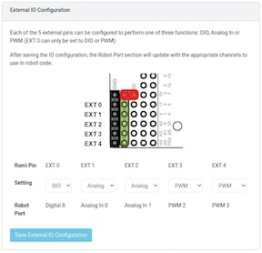

[comment]: render
# Day 7 First ROMI Project
## A ROMI line follower

### Project Overview

In this project we are looking to make a ROMI that can be teleoperated, but also have an autonomous routine that follows 
an electrical tape line. We will use VEX line follower sensors, and 2 of the ROMI's GPIO (General Purpose Input/Output) pins. 


You will also need to learn more about ways in which we create a modular and maintainable code base. Instead of all the 
functionality being in one file we will separate the drivetrain and autonomous controller functionality to separate classes.

### Setting up ROMI for Sensors

You will need to go to the ROMI interface. First make sure that you are connected to the ROMI by wifi and open a web browser.
In the search bar for the web browser type the following address 10.0.0.2. This is the IP address for the ROMI interface.
First click the button on the top that will allow you to make the ROMI "writable". This is necessary to make changes to 
the setup of the ROMI. 


After you have made the ROMI writable scroll down to find the settings of the GPIO interfaces. Change the second of these
to DIO so that you can use both line sensors. 




### Tips on installing the Sensors

The sensors work best underneath the robot. Make sure that they are close to the ground but not touching. 

### Code Requirements

A good base for the code is the FIRST_ROMI project that we previously made. You will want to start a new project, and copy
over the code from ```robot.py``` file that you had in that old project.

There will be three main files to this robot that go along with three main classes. Please name the files: ```robot.py```,
```drivetrain.py```, and ```linefollower.py```.

#### Requirements for  ```robot.py```

* Create a subclass of TimedRobot called MyRobot
* Have a run method that intiates the ROMI
* Import your code from the drivetrain.py and linefollower.py
* Create instances of Drivetrain, Joystick, and LineFollower in appropriate spots of your code.
* Create a Joystick and Drivetrain class and use it to drive the robot in TeleopPeriodic.
* Use the Drivetrain's methods to drive the robot in Teleoperated
* Use the LineFollower's methods to drive teh robot in Autonomous

#### Requirements for ```drivetrain.py```

* Create a Drivetrain class
* Instantiate the motors in this class
* Create a ```__init__``` method that sets up motors and uses a drivetrain object that comes for ```wpilib.drive.DifferentialDrive```
* Create a ```move``` method that takes in a forward and rotation numbers and passes those to the drivetrain object to make the robot move.

#### Requirements for ```linefollower.py```

* Create a LineFollower class
* Instantiate the two line sensor in this class.
* Create a ```__init__``` method that takes in a drivetrain that it will use to make the robot move.
* Create a ```run``` method of the LineFollower class that give directions to the drivetrain about how to move based on line 
following sensors.


### Some hints about to code the robot

* Make sure that you have the proper import lines in each file. You will need things like:

```python
from drivetrain import Drivetrain
```

* You will need to import the ```DigitalInput``` class from ```wpilib```


